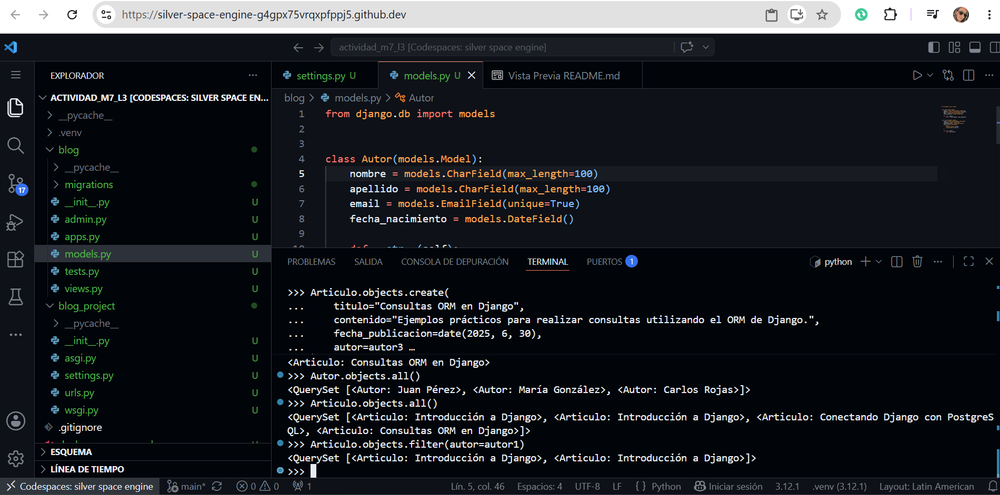

# Blog Project

Proyecto Django de ejemplo para un blog con dos modelos (Autor y Artículo) y base de datos PostgreSQL.

## Tecnologías

- **Python 3.12**
- **Django 6.0**
- **PostgreSQL 16**
- **psycopg2-binary** (conector PostgreSQL)
- **Docker** (para levantar PostgreSQL)

## Estructura del proyecto

```
blog_project/
│
├── .venv/                         # Entorno virtual
├── blog/                          # Aplicación principal
│   ├── migrations/
│   │   ├── 0001_initial.py
│   │   └── __init__.py
│   ├── __init__.py
│   ├── admin.py                   # Registro de modelos en admin
│   ├── apps.py                    # Configuración de la app
│   ├── models.py                  # Modelos Autor y Articulo
│   ├── tests.py
│   └── views.py
│
├── blog_project/                  # Configuración del proyecto
│   ├── __init__.py
│   ├── asgi.py
│   ├── settings.py                # Configuración (BD, apps, etc.)
│   ├── urls.py
│   └── wsgi.py
│
├── docker-compose.yml             # Servicio PostgreSQL
├── manage.py
├── requirements.txt
└── README.md
```

## Instalación

### 1. Clonar el repositorio

```bash
git clone <repo-url>
cd blog_project
```

### 2. Crear entorno virtual

```bash
python -m venv .venv
source .venv/bin/activate  # Linux/Mac
# .venv\Scripts\activate   # Windows
```

### 3. Instalar dependencias

```bash
pip install -r requirements.txt
```

### 4. Configurar PostgreSQL

#### Opción A: Con Docker (recomendado)

```bash
docker compose up -d
```

#### Opción B: Instalación local

Asegúrate de tener PostgreSQL instalado y crea la base de datos:

```bash
sudo -u postgres psql -c "CREATE DATABASE blog_db;"
```

### 5. Configurar settings.py

El archivo `blog_project/settings.py` ya incluye la configuración:

```python
DATABASES = {
    "default": {
        "ENGINE": "django.db.backends.postgresql",
        "NAME": "blog_db",
        "USER": "postgres",
        "PASSWORD": "postgres",
        "HOST": "localhost",
        "PORT": "5432",
    }
}
```

### 6. Ejecutar migraciones

```bash
python manage.py makemigrations   # Crear archivos de migración
python manage.py migrate           # Aplicar migraciones a la BD
```

### 7. Crear superusuario (opcional)

```bash
python manage.py createsuperuser
```

Acceder al admin en: `http://127.0.0.1:8000/admin/`

### 8. Ejecutar servidor

```bash
python manage.py runserver
```

## Modelos

### Autor

| Campo           | Tipo          | Restricciones    |
|-----------------|---------------|------------------|
| nombre          | CharField(100)|                  |
| apellido        | CharField(100)|                  |
| email           | EmailField    | unique=True      |
| fecha_nacimiento| DateField     |                  |

### Artículo

| Campo             | Tipo           | Restricciones                 |
|-------------------|----------------|-------------------------------|
| titulo            | CharField(200) |                               |
| contenido         | TextField      |                               |
| fecha_publicacion | DateField      |                               |
| autor             | ForeignKey     | → Autor (CASCADE, related)    |

**Relación:** Un Autor → muchos Artículos.

## Crear datos y consultas ORM

Abre el shell de Django e ingresa tus propios registros vía ORM:

```bash
python manage.py shell
```

```python
from datetime import date
from blog.models import Autor, Articulo

# --- Crear autores ---
autor1 = Autor.objects.create(
    nombre="Juan",
    apellido="Pérez",
    email="juan.perez@gmail.com",
    fecha_nacimiento=date(1990, 5, 15)
)

autor2 = Autor.objects.create(
    nombre="María",
    apellido="González",
    email="maria.gonzalez@gmail.com",
    fecha_nacimiento=date(1988, 8, 22)
)

autor3 = Autor.objects.create(
    nombre="Carlos",
    apellido="Rojas",
    email="carlos.rojas@gmail.com",
    fecha_nacimiento=date(1995, 2, 10)
)

# --- Crear artículos ---
Articulo.objects.create(
    titulo="Introducción a Django",
    contenido="En este artículo conoceremos los conceptos básicos de Django y su funcionamiento.",
    fecha_publicacion=date(2025, 6, 30),
    autor=autor1
)

Articulo.objects.create(
    titulo="Conectando Django con PostgreSQL",
    contenido="Aprenderemos cómo configurar una base de datos PostgreSQL en un proyecto Django.",
    fecha_publicacion=date(2025, 6, 30),
    autor=autor2
)

Articulo.objects.create(
    titulo="Consultas ORM en Django",
    contenido="Ejemplos prácticos para realizar consultas utilizando el ORM de Django.",
    fecha_publicacion=date(2025, 6, 30),
    autor=autor3
)

# --- Consultas ORM ---

# 1. Todos los autores
Autor.objects.all()

# 2. Todos los artículos
Articulo.objects.all()

# 3. Artículos de un autor específico
Articulo.objects.filter(autor=autor1)

```


